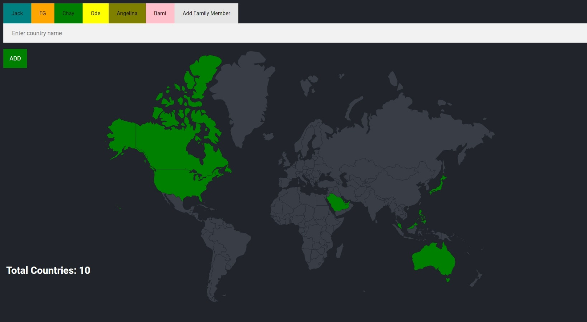
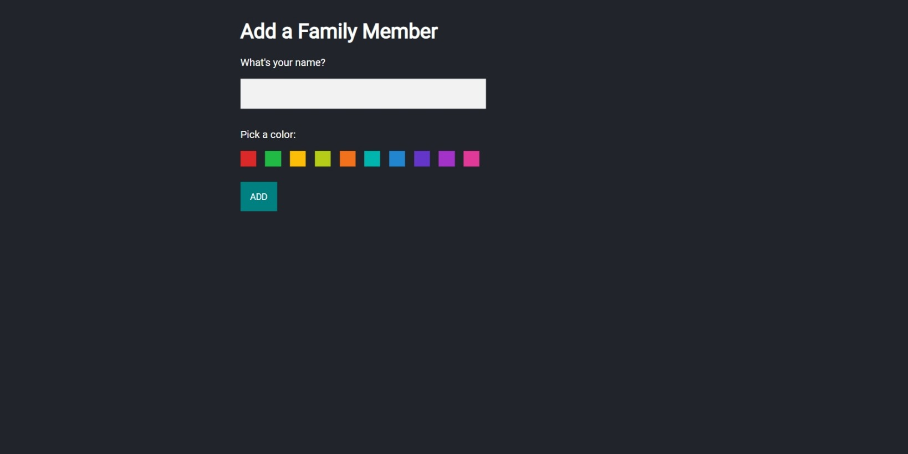

# Travel Tracker

This is a world travel that I created during my time in the london app brewery's web development bootcamp. This project demonstrates my skills and understanding of back end development, RESTful APIs, and SQL databases. 

## Table of contents

- [Overview](#overview)
  - [Screenshot](#screenshot)
- [My process](#my-process)
  - [Built with](#built-with)
  - [What I learned](#what-i-learned)

## Overview

### Screenshot

The travel tracker is capable of storing the countries in the world that each user has visited, and displays them by coloring them in the world map. This project was made with a PostgreSQL database, and is capable of adding more users. 

## My process

### Built with
- HTML
- CSS
- EJS
- Javascript
- NodeJS
- PostgreSQL

### What I learned

I was able to perform various media queries in a PostgreSQL database.
